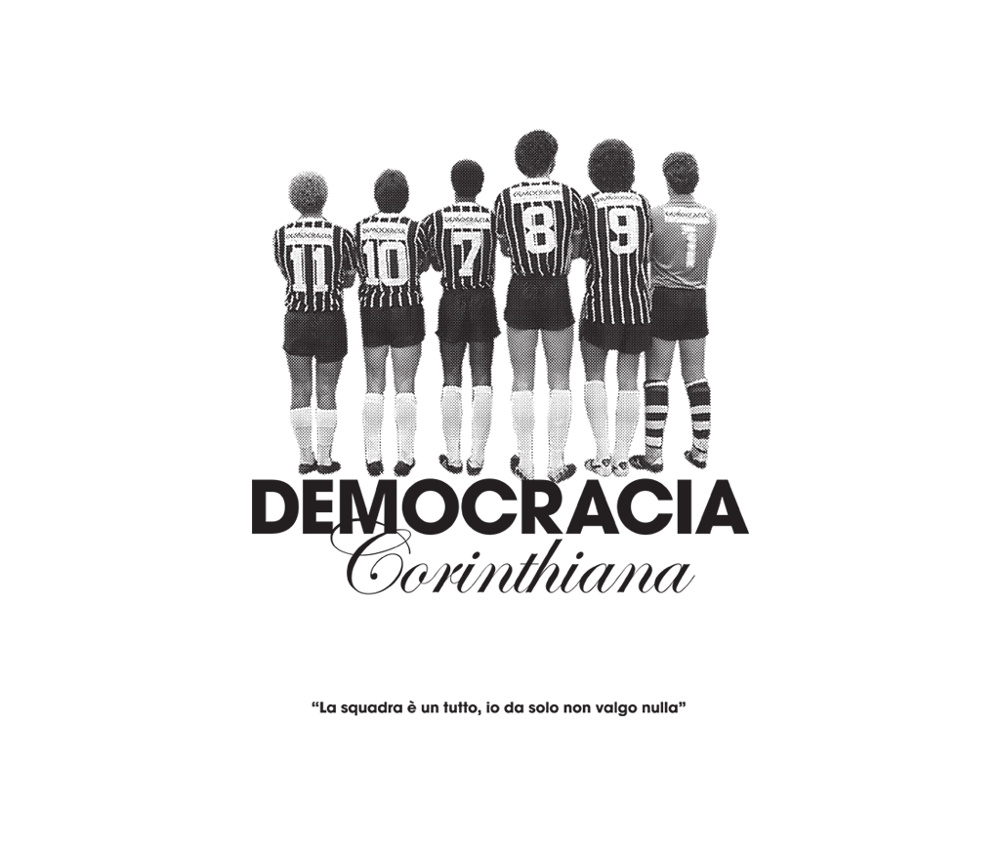
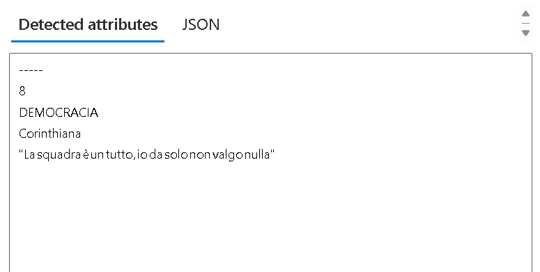

# Read text in Vision Studio
This repository is a copy to [Microsoft Learn](https://microsoftlearning.github.io/mslearn-ai-fundamentals/Instructions/Labs/05-ocr.html)
In this exercise you’ll use Azure AI service to explore the optical character recognition capabilities of Azure AI Vision. You’ll use Vision Studio to experiment with extracting text from images, without having to write any code.

A common computer vision challenge is to detect and interpret text embedded within an image. This is known as optical character recognition (OCR). In this exercise you’ll use an Azure AI services resource, which includes Azure AI Vision services. You’ll then use Vision Studio to try out OCR with different types of images.

## Create an Azure AI services resource
You can use Azure AI Vision’s OCR capabilities with an Azure AI services multi-service resource. If you haven’t already done so, create an Azure AI services resource in your Azure subscription.

1. In another browser tab, open the Azure portal at https://portal.azure.com, signing in with the Microsoft account associated with your Azure subscription.
2. Click the ＋Create a resource button and search for Azure AI services. Select create an Azure AI services plan. You will be taken to a page to create an Azure AI services resource. Configure it with the following settings:
  - Subscription: Your Azure subscription.
  - Resource group: Select or create a resource group with a unique name.
  - Region: East US.
  - Name: Enter a unique name.
  - Pricing tier: Standard S0.
  - By checking this box I acknowledge that I have read and understood all the terms below: Selected. 
  
3. Select Review + create then Create and wait for deployment to complete.

## Connect your Azure AI service resource to Vision Studio
Next, connect the Azure AI services resource you provisioned above to Vision Studio.
1. In another browser tab, navigate to Vision Studio at https://portal.vision.cognitive.azure.com.
2. Sign in with your account and making sure you are using the same directory as the one where you have created your Azure AI services resource.
3. On the Vision Studio home page, select View all resources under the Getting started with Vision heading.
4. On the Select a resource to work with page, hover your mouse cursor over the resource you created above in the list and then check the box to the left of the resource name, then select Select as default resource.
  > Note : If your resource is not listed, you may need to Refresh the page.
5. Close the settings page by selecting the “x” at the top right of the screen.

## Extract text from images in the Vision Studio
1. In a web browser, navigate to Vision Studio at https://portal.vision.cognitive.azure.com.
2. On the Getting started with Vision landing page, select Optical character recognition, and then the Extract text from images tile.
3. Under the Try It Out subheading, acknowledge the resource usage policy by reading and checking the box.
4. Select https://aka.ms/mslearn-ocr-images to download ocr-images.zip. Then open the folder.
5. On the portal, select Browse for a file and navigate to the folder on your computer where you downloaded ocr-images.zip. Select advert.jpg and select Open.
6. Now review what is returned:
  - In Detected attributes, any text found in the image is organized into a hierarchical structure of regions, lines, and words.
  - On the image, the location of text is indicated by a bounding box, as shown here:
7. You can now try another image. Select Browse for a file and navigate to the folder where you saved the files from GitHub. Select letter.jpg.
8. Review the results of the second image. It should return the text and bounding boxes of the text. If you have time, try note.jpg and receipt.jpg.

## Extract text from images in the Vision Studio
Example:

Input                      |  Output
:-------------------------:|:-------------------------:
  |  

## Clean up
If you don’t intend to do more exercises, delete any resources that you no longer need. This avoids accruing any unnecessary costs.
1. Open the Azure portal at https://portal.azure.com and select the resource group that contains the resource you created.
2. Select the resource and select Delete and then Yes to confirm. The resource is then deleted.
